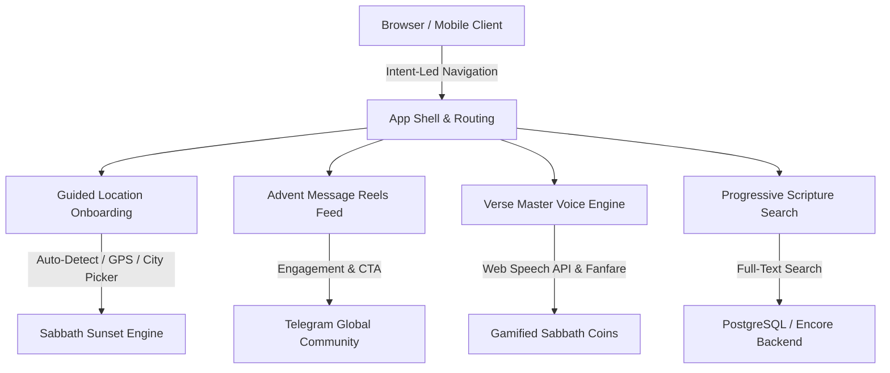

# 🎓 Qwory Teacher: The Ultimate Guide to Adventist Go

**Welcome, Brian!** This guide breaks down the full technical architecture, design philosophy, recent UI/UX overhaul, and engineering lessons behind **Adventist Go** (`https://adventistgoapp.vercel.app`).

---

## 🌟 1. The Vision & The Problem We Solved

### The Core Premise:
Sabbath preparation is a time-bound, sacred ritual. Every Friday at sunset, millions of Seventh-day Adventists worldwide enter 24 hours of rest and worship. However, modern life is full of digital noise, scattered study resources, and uncertain sunset calculations.

### What Was Broken (The UI/UX Audit Findings):
1. **The "Location Required" Wall:** If a first-time user opened the app and hadn''t allowed browser GPS, they hit a blank card saying "Location Required" with no fallback, no city picker, and no way to experience the app.
2. **Horizontal Nav Explosion:** 13 individual navigation links were squished into a single desktop header line (`scrollWidth: 1480px` on a 1280px screen), causing horizontal scrollbars and clutter.
3. **Hardcoded UTC Timezone:** The app defaulted to UTC instead of detecting the user''s local browser timezone.
4. **Search Decision Paralysis:** The Bible search page presented 6 dropdowns and options simultaneously with equal visual weight before the user even typed a word.

---

## 🏗️ 2. The Architectural Solution



### Key Engineering Transformations:

#### 1. Guided Location Onboarding & Privacy Architecture
- **Auto-Detection:** Uses `Intl.DateTimeFormat().resolvedOptions().timeZone` to instantly identify the local timezone (e.g. `Africa/Nairobi`, `America/New_York`, `Europe/London`).
- **1-Click City Quick-Select:** Pre-loaded coordinates for major world centers (Nairobi, London, Los Angeles, Kingston, São Paulo, Seoul, Tokyo, etc.).
- **Local Sunset Math Fallback:** Calculates astronomical Friday and Saturday sunset times client-side so the countdown works offline even before network or GPS is ready.
- **Privacy Guarantee:** GPS coordinates never leave the browser; they stay in `localStorage`.

#### 2. Intent-Led Navigation (Desktop & Mobile)
- Grouped 14 destinations into 5 clear mental models:
  - **Countdown / Home:** The persistent anchor.
  - **🎈 Kids Go:** A standalone, prominently branded mode at `/kids` (see Section 2.5 below).
  - **Prepare:** Checklist (`/prep`), Digital Detox (`/detox`).
  - **Study:** Bible Lookup (`/bible`), Verse Master (`/verse-master`), Sabbath School (`/sabbath-school`), Devotionals (`/devotionals`), Hymnal (`/hymns`).
  - **Watch:** Advent Message Reels (`/reels`).
  - **Community:** Family Worship (`/family`), Church Finder (`/churches`), Journal (`/journal`).
- Added a **Mobile Bottom Tab Bar** with 5 fast-switch tabs: `Countdown`, `Kids Go 🎈`, `Reels`, `Bible`, `More`.
- Kids Go gets a distinctive amber-to-pink gradient treatment in both desktop and mobile nav so parents can spot it instantly.

#### 3. Progressive Disclosure Scripture Search
- The main search input and match type pills (`Keyword`, `Phrase`, `Topic`) take primary visual dominance.
- Advanced options (`Translation`, `Testament`, `Book`) are neatly tucked inside an expandable **Filters** disclosure with active filter count badges.
- When empty, the page suggests curated Adventist theological topics (*Creation*, *Sabbath Rest*, *Sanctuary in Heaven*, *Second Coming*, *Three Angels Messages*).

#### 4. Advent Message Reels & Verse Master Voice Engine
- Vertical 9:16 snap-scroll player with pillar filters (`prophecy`, `sabbath`, `gospel`, `health`, `kids`).
- Web Speech API voice recognition engine with fuzzy text scoring and Web Audio API synthesized fanfare.

#### 5. Adventist Kids Go Mode (`/kids`)
This is a full child-friendly Sabbath experience hub. It lives at `/kids` and contains four interactive sections:

- **📖 Bible Stories:** 5 illustrated stories (*Creation*, *Noah's Ark*, *David & Goliath*, *Daniel in the Lions' Den*, *Jesus Calms the Storm*), each with an age-appropriate narrative and a memory verse to recite.
- **🎵 Sing Along:** 4 beloved children's hymns (*Jesus Loves Me*, *This Little Light of Mine*, *I've Got the Joy*, *The Wise Man Built His House*) with lyrics that kids can follow while singing.
- **🌿 Nature Explorer:** A Sabbath scavenger hunt bingo board with 8 outdoor items to find (butterfly, bird, flower, cloud shapes, etc.). Each found item awards a ⭐, persisted in `localStorage` under the key `kids_stars`.
- **🏆 Verse Master Junior:** A quick-launch button that takes kids directly to the `/verse-master` game in a simplified context.

**Why a separate mode?** Kids need big tap targets, bright colours, minimal text, and zero navigation friction. Embedding these activities inside the adult Study or Community groups would bury them. A top-level "Kids Go 🎈" tab with a distinctive gradient (amber → pink) gives parents a one-tap hand-off: *"Here, play this while I finish cooking."*

**Technical pattern — localStorage star system:**
```typescript
// Read stars (with safe fallback)
const stars = parseInt(localStorage.getItem('kids_stars') || '0');
// Award a star
localStorage.setItem('kids_stars', String(stars + 1));
```
Stars survive page reloads and app restarts — no backend needed. This is the same persistence pattern used for user location (`adventist_user_location`). Simple, private, zero-cost.

---

## 💡 3. Lessons for High-Performance Engineering

### Analogy: The "Locked Door" Anti-Pattern
Imagine walking into a bakery, but before you can see the bread, the baker asks for your passport. If you don''t show it, the door stays locked.
*That was the original "Location Required" screen.*
**Good software rolls out the welcome mat first:** It shows you the bread (a live countdown based on detected timezone or a popular city) and offers a friendly button: *"Want your exact sunset? Tap Detect My Location."*

### Why Progressive Disclosure Wins:
Cognitive load is real. Showing 10 controls at once induces decision paralysis. Grouping controls into primary actions (search) and secondary disclosures (filters) makes complex apps feel light and effortless.

---

## 🚀 4. Live Resources
* **Production Web App:** [adventistgoapp.vercel.app](https://adventistgoapp.vercel.app)
* **GitHub Repository:** [github.com/Iammcqwory/adventist-go-app](https://github.com/Iammcqwory/adventist-go-app)
